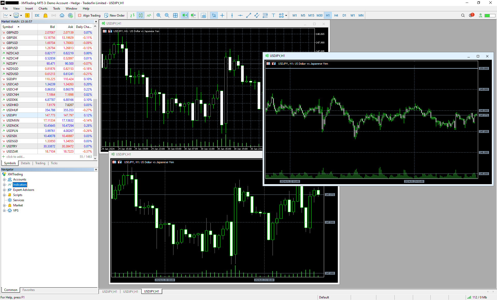

# GridLines
## 概要
MT5のチャート画面のグリッド線を変更するインジケータです。水平線はラウンドナンバーに、垂直線は単位時間ごと（例：10分、1時間、半日、1日…）になります。どちらとも意味のある数字に線が引かれるようになるため見やすくなります。 

## 使用方法
1. ReleasesからGridLines.zipをダウンロードします。
1. zipファイルの内容をMT5のデータフォルダにコピーします。  
    ※ デフォルトのデータフォルダは以下：
    C:\Users\（ユーザー名）\AppData\Roaming\MetaQuotes\Terminal\（インスタンスID）
1. MT5を起動します。
1. NavigatorウィンドウのIndicatorsツリーからGridLinesをチャートに貼り付けます。  

## 必要なもの
- 本ツールの利用にはMT5が必要です。各証券会社がHPで配布しています。本ツールはどの証券会社のMT5でも動作します。

## 補足
- MT4では動作しません。コンパイルも通りません。
